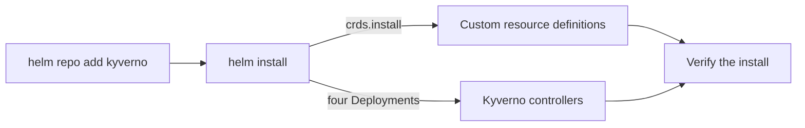

# Kyverno Installation & Configuration with Helm

Astronaut, every Kyverno cluster starts the same way: someone runs `helm install`. Helm is the shipyard crane that assembles a whole station from a kit. That one command creates four controller Deployments, a webhook configuration, a ConfigMap full of runtime settings and a whole family of custom resource definitions.

Every one of those pieces can be sized, switched on or off, or changed from the values you pass in. This module teaches you that surface. Almost everything else you do to run Kyverno is "one more value you hand to Helm".

The diagram shows the order: add the Helm repository, install the chart into its own namespace, and then check both the custom resource definitions and the four controllers (admission, background, reports and cleanup) with `kubectl get` and `helm list`.

## Learning objectives

After this module you can:

- Add the `kyverno` Helm repository and run a correct baseline install into a dedicated namespace.
- Explain why Kyverno must never share a namespace with other applications.
- Explain what `crds.install` controls and check whether Helm installed Kyverno's custom resource definitions.
- Set `admissionController.replicas` and `admissionController.container.resources` with `--set` or a values file.
- Use `helm upgrade --install`, `helm list`, `helm status` and `helm get values -a` to install safely more than once and to check the real configuration.
- Extend a list value, such as `config.excludeGroups`, without losing the entries you want to keep.

## Before you start

Every mission starts with a pre-flight check, astronaut. Here is what this module expects you to know, and where you will practise.

### What you should already know

- **Basic `kubectl`.** Getting pods, Deployments and namespaces, and reading output in YAML.
- **No Helm yet.** This module teaches Helm from the Kyverno chart outward.

### Where you practise

This module has no playground. You practise in the graded mission at the end of the second part. The mission gives you a `kind` cluster (a training solar system in the simulator) with `kubectl` and `helm` ready to use. The `kyverno` Helm repository is already added there, and Kyverno is **not** installed: installing it correctly is the task.

The commands in the parts work on any test cluster where you are allowed to install Kyverno.

## How this module is organised

1. **[Adding the Repo & a Baseline Install](./course-01-adding-the-repo-and-a-baseline-install.md):** the official Helm repository, the dedicated-namespace rule, a correct baseline install, and how to check it.
2. **[Customizing the Install: values.yaml & --set](./course-02-customizing-with-values-and-set.md):** custom resource definition management, replicas, resources and controller switches, set with `--set` or a values file. Your first mission follows this part.
3. **[Re-running and Auditing the Install](./course-03-re-running-and-auditing-the-install.md):** `helm upgrade --install`, reading back the real values, and the list-replacement trap.
4. **[Wrap-Up](./course-04-wrap-up.md):** what you learned, your missions, and cleaning up.

## Why this matters

Writing a policy is easy once Kyverno runs correctly. Getting it to run correctly is the part most guides skip. If you know which values shape the install and how to read back what really landed, every later change to Kyverno is a small, checkable step.
