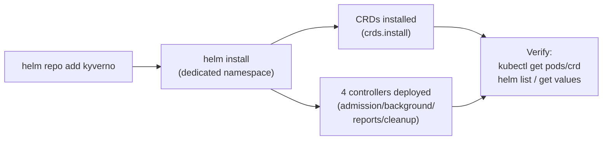

# Kyverno Installation & Configuration with Helm

Every Kyverno cluster starts the same way: something runs `helm install`. That one command creates four controller Deployments, a webhook configuration, a ConfigMap full of runtime settings, and a whole family of CRDs — and every one of those pieces can be sized, toggled, or overridden right from the values you pass in. Get comfortable with that surface now, because everything later in this domain (CRDs, controller flags, RBAC, HA, upgrades) is really just "more things you can hand to Helm."

## How this module is organised

1. **[Part 1 — Adding the Repo & a Baseline Install](./course-01-adding-the-repo-and-a-baseline-install.md)** — the official Helm repo, the dedicated-namespace rule, and a correct baseline install.
2. **[Part 2 — Customizing the Install: values.yaml & --set](./course-02-customizing-with-values-and-set.md)** — reaching into `values.yaml` for replicas, resources, CRD management, and auditing what actually landed.

## Learning objectives

After this module you can:

- Add the `kyverno` Helm repo and run a correct baseline install into a dedicated namespace.
- Explain why Kyverno must never share a namespace with other applications.
- Explain what `crds.install` controls and confirm whether Helm installed Kyverno's CRDs.
- Set `admissionController.replicas` and `admissionController.container.resources` via `--set` or a values file.
- Use `helm upgrade --install`, `helm list`, `helm status`, and `helm get values -a` to install idempotently and audit the effective configuration.

## Before you start

You should be comfortable with basic `kubectl` usage. No prior Helm experience is assumed — this module teaches it from the Kyverno chart outward.

The linked lab gives you a kind Kubernetes cluster with `kubectl` and `helm` already configured, and the `kyverno` Helm repo not yet added. Kyverno is **not** pre-installed — installing it correctly is the graded task.
