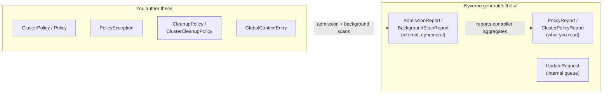

# Kyverno's CRD Surface

Install Kyverno and it does not add a single opaque binary to your cluster — it registers a family of Custom Resource Definitions and then runs controllers that watch them. That single design decision, first introduced in Section 010, has a direct consequence you have not yet had to reckon with: Kyverno's entire behavior is spread across *multiple* CRD kinds, not one. Some of them you author by hand. Others Kyverno generates on your behalf and expects you to only ever read.

Confusing the two is the single most common source of "why isn't my policy doing anything" debugging sessions. This module draws the map so you never have to guess again.

## How this module is organised

1. **[Part 1 — Policy-Authoring CRDs](./course-01-policy-authoring-crds.md)** — `ClusterPolicy`/`Policy` recapped, then `PolicyException`, `CleanupPolicy`/`ClusterCleanupPolicy`, and `GlobalContextEntry` in full.
2. **[Part 2 — Reporting & State CRDs](./course-02-reporting-and-state-crds.md)** — `PolicyReport`/`ClusterPolicyReport` as the results you read, `AdmissionReport`/`BackgroundScanReport`/`UpdateRequest` as the internal plumbing that produces them.

## Learning objectives

After this module you can:

- List the CRDs Kyverno registers and classify each as policy-authoring or reporting/state.
- Explain what a `PolicyException` does, why it is disabled by default, and which two admission-controller flags enable and scope it.
- Describe `CleanupPolicy`/`ClusterCleanupPolicy`'s `match`/`conditions`/`schedule` shape and that it is deprecated in favor of `DeletingPolicy` as of v1.19.
- Explain what a `GlobalContextEntry` caches and why that avoids redundant per-policy API calls.
- Distinguish `PolicyReport`/`ClusterPolicyReport` (end-user facing) from `AdmissionReport`/`BackgroundScanReport` (internal, ephemeral).
- Use `kubectl get crd | grep kyverno.io` and `kubectl api-resources | grep -i kyverno` to enumerate the full CRD surface on a live cluster.

## Before you start

The linked lab gives you a kind Kubernetes cluster with Kyverno v1.13.2 already installed by its bootstrap script, plus one pre-applied sample `ClusterPolicy` — see the lab's `README.md` for exactly what is seeded. You should already be comfortable with `ClusterPolicy`/`Policy` rule anatomy and `match`/`exclude` (Section 010 of ATS007, *Fundamentals of Kyverno*, if you need a refresher).
