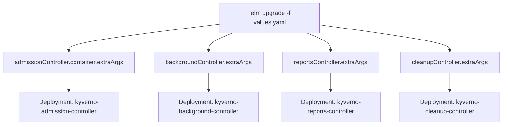

# Tuning Kyverno's Controllers with Flags

Helm install Kyverno and `kubectl get pods -n kyverno` shows you four Deployments, not one: an admission controller, a background controller, a reports controller, and a cleanup controller. That split is not cosmetic. Each Deployment runs a distinct binary, built for a distinct job, and each accepts its own set of command-line flags that control timeouts, concurrency, scan intervals, and rate limits independently of the other three.

This module is where you stop treating "Kyverno" as one undifferentiated thing to tune, and start treating it as four separate processes — reading their live arguments directly off the cluster, and changing them the supported way, through Helm.

## How this module is organised

1. **[Part 1 — The Four Controllers & Their Flags](./course-01-the-four-controllers-and-their-flags.md)** — what each controller does, and the specific flags it exposes for timeouts, concurrency, scanning, and rate limiting.
2. **[Part 2 — Setting Flags via Helm](./course-02-setting-flags-via-helm.md)** — the `extraArgs` values pattern, its inconsistent nesting across controllers, and how ConfigMap-driven settings differ from container flags.

## Learning objectives

After this module you can:

- Name the four Kyverno controllers and match each to its core responsibility (admission, background scanning, report aggregation, cleanup).
- List at least two tunable flags per controller and explain what each one controls.
- Read a controller's live command-line arguments directly from its Deployment with `kubectl`.
- Set a controller flag through Helm's `extraArgs` values, correctly matching each controller's actual key nesting.
- Explain the difference between a ConfigMap-driven setting (often hot-reloaded) and a container flag (always requires a pod restart).

## Before you start

The linked lab gives you a kind Kubernetes cluster with Kyverno already installed via Helm at baseline values, and `kubectl`/`helm` already configured against it. You should already be comfortable with a basic `helm install`/`helm upgrade` workflow (Section 010, *Helm-based Installation and Configuration*).
