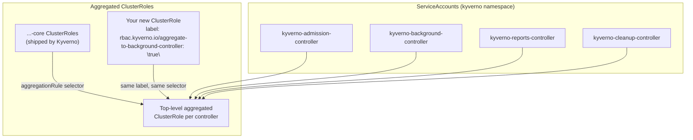

# Kyverno's RBAC Model

A controller that can read, mutate, and generate almost any resource in your cluster is a controller you should want to run with the narrowest permissions that actually work — not `cluster-admin`. Kyverno's own RBAC is built that way on purpose: four separate ServiceAccounts, one per controller, each backed by a ClusterRole assembled from smaller, labeled pieces rather than one sprawling hand-written policy.

That assembly mechanism — Kubernetes ClusterRole aggregation — is also the *extension point*. When a `generate` rule needs to create a resource kind Kyverno wasn't shipped with permission for, you don't edit Kyverno's role. You add a new one, carrying the right label, and Kubernetes folds it in automatically.

## How this module is organised

1. **[Part 1 — ServiceAccounts, Aggregated ClusterRoles & Built-in View Access](./course-01-serviceaccounts-and-aggregated-clusterroles.md)** — the four ServiceAccounts, how aggregation assembles their permissions, and the built-in `view` role binding.
2. **[Part 2 — Granting Extra Permissions Safely](./course-02-granting-extra-permissions-safely.md)** — why `generate` rules sometimes need more RBAC than Kyverno ships with, and the one correct way to grant it.

## Learning objectives

After this module you can:

- Name the four Kyverno controllers and their corresponding ServiceAccounts.
- Explain how Kubernetes ClusterRole aggregation assembles a controller's effective permissions from labeled ClusterRoles.
- Identify the `rbac.kyverno.io/aggregate-to-<controller>-controller` label pattern and which controller each label extends.
- Explain what the built-in `view` ClusterRole binding gives Kyverno's controllers, and why.
- Diagnose a `generate` rule failing for lack of RBAC, and fix it with a new, correctly-labeled ClusterRole instead of editing a default role.

## Before you start

The linked lab gives you a kind Kubernetes cluster with Kyverno already installed via Helm by its bootstrap script, plus a pre-applied `ClusterPolicy` with a `generate` rule that is deliberately missing the RBAC it needs — diagnosing and fixing that gap is the lab's graded task. You should be comfortable with `kubectl get`/`describe`/`apply` and basic Kubernetes RBAC objects (`ClusterRole`, `ClusterRoleBinding`).
