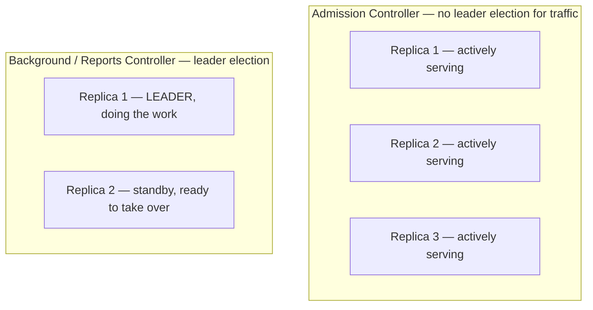

# Running Kyverno Highly Available

"Just set `replicas: 3`" is good advice for a stateless web server and dangerously incomplete advice for Kyverno. Kyverno is not one workload — it is four independent controllers bundled under one Helm release, and each one was built with a different answer to the question "what happens when I run more than one copy of you?"

Get this wrong in either direction and you pay for it: under-provision the admission controller and a single Pod restart can stall every write to the cluster; over-provision the background controller expecting more scan throughput and you've just spent extra CPU and memory for zero extra work getting done.

## How this module is organised

1. **[Part 1 — Why Replicas Behave Differently Per Controller](./course-01-why-replicas-behave-differently.md)** — the admission controller's horizontal scaling vs the background/reports controllers' leader election, and the cleanup controller's hybrid model.
2. **[Part 2 — Installing for HA with Helm](./course-02-installing-for-ha-with-helm.md)** — the documented production install command, why the replica counts differ per controller, and general node-spreading hygiene.

## Learning objectives

After this module you can:

- Explain why the admission controller scales horizontally with no leader election for AdmissionReview traffic, while the background and reports controllers do not.
- State Kyverno's documented minimum recommended admission-controller replica count for production.
- Explain what extra replicas actually buy the background, reports, and cleanup controllers (failover, not throughput).
- Run the documented HA `helm install` command with the correct replica count per controller.
- Inspect leader-election state on a live cluster using `kubectl get lease -n kyverno`.

## Before you start

You should already be comfortable installing Kyverno via Helm (Section 010) and reading/writing Helm values (`--set`, `-f values.yaml`). The linked lab gives you a kind Kubernetes cluster with `kubectl` and `helm` already configured, and the `kyverno` Helm repo already added — Kyverno itself is not yet installed, since installing it correctly is the graded task.
