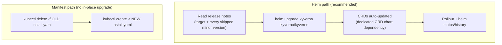

# Upgrading a Running Kyverno Installation

"Just bump the version" sounds trivial for most workloads. It is not trivial for Kyverno, because Kyverno's admission controller sits directly in the write path of every resource your cluster's API server accepts. If an upgrade goes wrong mid-rollout — a webhook briefly unreachable, a CRD field that changed shape, a policy that behaves differently against the new binary — the blast radius isn't "one app had a bad deploy," it's "nothing could be created or updated cluster-wide for a few seconds." That's not a reason to fear upgrades. It's a reason to do them the way this module describes: deliberately, with the right tool, with a backup in hand, and with a clear idea of what "verified healthy" actually means afterward.

## How this module is organised

1. **[Part 1 — The Helm Upgrade Path](./course-01-the-helm-upgrade-path.md)** — the `helm upgrade` command itself, why release notes matter for every version you skip, and the CRD-upgrade behavior that catches most Helm users off guard.
2. **[Part 2 — Manifest Upgrades & Post-Upgrade Validation](./course-02-manifest-upgrades-and-post-upgrade-validation.md)** — why a plain-manifest install has no in-place upgrade path, the `kyverno migrate` CLI, and the backup/verify checklist to run around every upgrade.

## Learning objectives

After this module you can:

- Run `helm upgrade` against an existing Kyverno release to change values or bump the chart version.
- Explain why Kyverno's CRDs *are* updated by a normal `helm upgrade`, unlike CRDs shipped in many other charts' special `crds/` directory.
- Explain why a manifest-based (`kubectl create -f install.yaml`) install cannot be upgraded in place, and what the correct procedure is instead.
- Back up existing `ClusterPolicy`/`Policy` objects before an upgrade, and verify an upgrade's success with `helm status`, `helm history`, and rollout checks.
- Describe what `kyverno migrate` is for.

## Before you start

The linked lab gives you a kind Kubernetes cluster with Kyverno already installed via Helm at a baseline configuration. You should be comfortable with the Helm install/values concepts from Section 010 — this module builds directly on them.
